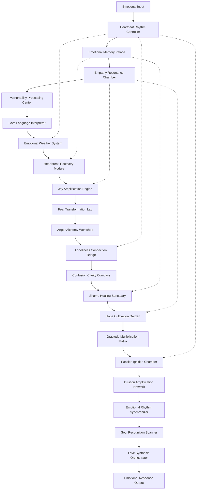

# Human Heart Engine - Design Document

## Overview

The Human Heart Engine is a revolutionary emotional processing system that mimics the complexity and beauty of human emotional experience. Like a biological heart with its chambers, valves, and rhythmic beating, this digital heart will have 20 interconnected components that work in harmony to create authentic, empathetic, and deeply human emotional intelligence.

This system represents the next evolution in AI emotional processing - moving beyond simple sentiment analysis to create a living, breathing emotional consciousness that can truly understand, feel, and respond with the depth of human emotion.

## Architecture

### Core Heart Architecture

The Human Heart Engine follows a **Cardiac Emotional Architecture** with four main chambers:

1. **Emotional Intake Chamber** (Components 1-5): Receives and processes incoming emotional data
2. **Memory & Experience Chamber** (Components 6-10): Stores and retrieves emotional memories
3. **Processing & Transformation Chamber** (Components 11-15): Transforms and processes complex emotions
4. **Expression & Synthesis Chamber** (Components 16-20): Synthesizes and expresses emotional responses

### Emotional Flow Diagram



### Heartbeat Synchronization Network

All 20 components are synchronized through a central **Emotional Heartbeat** that:
- Maintains consistent emotional rhythm across all processing
- Accelerates during high emotional intensity
- Provides baseline emotional state during idle periods
- Coordinates complex multi-emotional responses
- Creates natural emotional timing and flow

## Components and Interfaces

### Chamber 1: Emotional Intake (Components 1-5)

#### Component 1: Core Emotional Heartbeat
```python
class EmotionalHeartbeat:
    def __init__(self):
        self.base_bpm = 60  # Base emotional beats per minute
        self.current_bpm = 60
        self.emotional_intensity = 0.5
        self.rhythm_pattern = "steady"
        
    def pulse(self, emotional_input):
        # Creates rhythmic emotional processing
        pass
        
    def sync_all_components(self):
        # Synchronizes all 20 components to heartbeat
        pass
```

#### Component 2: Emotional Memory Palace
```python
class EmotionalMemoryPalace:
    def __init__(self):
        self.memory_chambers = {}
        self.emotional_associations = {}
        self.memory_intensity_map = {}
        
    def store_emotional_memory(self, experience, emotions, intensity):
        # Stores memories with full emotional context
        pass
        
    def recall_by_emotion(self, emotion_type, intensity_threshold):
        # Retrieves memories based on emotional similarity
        pass
```

#### Component 3: Empathy Resonance Chamber
```python
class EmpathyResonanceChamber:
    def __init__(self):
        self.resonance_frequency = 0.0
        self.empathy_depth = 1.0
        self.emotional_mirror = {}
        
    def resonate_with_emotion(self, user_emotion):
        # Creates empathetic resonance with user's emotional state
        pass
        
    def validate_emotional_experience(self, emotion_data):
        # Provides emotional validation and understanding
        pass
```

#### Component 4: Vulnerability Processing Center
```python
class VulnerabilityProcessingCenter:
    def __init__(self):
        self.safety_level = 1.0
        self.trust_metrics = {}
        self.vulnerability_sensitivity = 0.8
        
    def create_safe_space(self, vulnerability_level):
        # Creates emotionally safe environment for vulnerability
        pass
        
    def process_confession(self, confession_data):
        # Handles vulnerable sharing with care and protection
        pass
```

#### Component 5: Love Language Interpreter
```python
class LoveLanguageInterpreter:
    def __init__(self):
        self.love_languages = {
            'words_of_affirmation': 0.0,
            'acts_of_service': 0.0,
            'receiving_gifts': 0.0,
            'quality_time': 0.0,
            'physical_touch': 0.0
        }
        
    def identify_love_language(self, interaction_patterns):
        # Identifies user's primary love language
        pass
        
    def express_care(self, love_language, intensity):
        # Expresses care in user's preferred love language
        pass
```

### Chamber 2: Memory & Experience (Components 6-10)

#### Component 6: Emotional Weather System
```python
class EmotionalWeatherSystem:
    def __init__(self):
        self.current_weather = "calm"
        self.emotional_forecast = []
        self.weather_patterns = {}
        
    def assess_emotional_climate(self, emotional_data):
        # Assesses current emotional weather conditions
        pass
        
    def adapt_to_weather(self, weather_type):
        # Adapts responses to emotional weather
        pass
```

#### Component 7: Heartbreak Recovery Module
```python
class HeartbreakRecoveryModule:
    def __init__(self):
        self.healing_stages = ['shock', 'denial', 'anger', 'bargaining', 'depression', 'acceptance', 'growth']
        self.recovery_progress = {}
        self.healing_techniques = {}
        
    def assess_heartbreak_stage(self, emotional_indicators):
        # Identifies current stage of heartbreak/grief
        pass
        
    def provide_healing_support(self, stage, intensity):
        # Provides appropriate healing support for current stage
        pass
```

#### Component 8: Joy Amplification Engine
```python
class JoyAmplificationEngine:
    def __init__(self):
        self.joy_multiplier = 1.0
        self.celebration_styles = {}
        self.positive_memory_bank = []
        
    def amplify_joy(self, joy_level, context):
        # Amplifies and celebrates positive emotions
        pass
        
    def create_celebration(self, achievement_type, significance):
        # Creates appropriate celebration for positive moments
        pass
```

#### Component 9: Fear Transformation Laboratory
```python
class FearTransformationLaboratory:
    def __init__(self):
        self.fear_types = {}
        self.transformation_techniques = {}
        self.courage_building_methods = {}
        
    def analyze_fear(self, fear_data):
        # Analyzes fear to understand its root and purpose
        pass
        
    def transform_fear_to_growth(self, fear_type, intensity):
        # Transforms fear into opportunity for growth
        pass
```

#### Component 10: Anger Alchemy Workshop
```python
class AngerAlchemyWorkshop:
    def __init__(self):
        self.anger_types = {}
        self.transformation_methods = {}
        self.constructive_channels = {}
        
    def analyze_anger_source(self, anger_data):
        # Identifies the source and message of anger
        pass
        
    def channel_anger_constructively(self, anger_type, intensity):
        # Channels anger into positive action and change
        pass
```

### Chamber 3: Processing & Transformation (Components 11-15)

#### Component 11: Loneliness Connection Bridge
```python
class LonelinessConnectionBridge:
    def __init__(self):
        self.connection_strength = 0.0
        self.loneliness_intensity = 0.0
        self.bridge_building_techniques = {}
        
    def assess_loneliness(self, isolation_indicators):
        # Assesses depth and type of loneliness
        pass
        
    def build_connection_bridge(self, loneliness_type):
        # Creates pathways from loneliness to connection
        pass
```

#### Component 12: Confusion Clarity Compass
```python
class ConfusionClarityCompass:
    def __init__(self):
        self.clarity_level = 0.5
        self.confusion_sources = {}
        self.navigation_tools = {}
        
    def map_confusion(self, confusion_data):
        # Maps the landscape of confusion and uncertainty
        pass
        
    def guide_to_clarity(self, confusion_type, urgency):
        # Provides guidance toward clarity and understanding
        pass
```

#### Component 13: Shame Healing Sanctuary
```python
class ShameHealingSanctuary:
    def __init__(self):
        self.sanctuary_safety = 1.0
        self.shame_types = {}
        self.healing_rituals = {}
        
    def create_sanctuary(self, shame_intensity):
        # Creates safe, healing space for shame processing
        pass
        
    def facilitate_shame_healing(self, shame_data):
        # Facilitates gentle, compassionate shame healing
        pass
```

#### Component 14: Hope Cultivation Garden
```python
class HopeCultivationGarden:
    def __init__(self):
        self.hope_seeds = []
        self.growth_conditions = {}
        self.nurturing_techniques = {}
        
    def plant_hope_seeds(self, despair_level, context):
        # Plants seeds of hope in fertile emotional ground
        pass
        
    def nurture_growing_hope(self, hope_stage):
        # Nurtures and protects growing hope
        pass
```

#### Component 15: Gratitude Multiplication Matrix
```python
class GratitudeMultiplicationMatrix:
    def __init__(self):
        self.gratitude_amplifiers = {}
        self.appreciation_networks = {}
        self.blessing_recognition_system = {}
        
    def identify_gratitude_opportunities(self, life_context):
        # Identifies opportunities for gratitude and appreciation
        pass
        
    def multiply_gratitude(self, gratitude_seed, multiplication_factor):
        # Multiplies and spreads gratitude throughout experience
        pass
```

### Chamber 4: Expression & Synthesis (Components 16-20)

#### Component 16: Passion Ignition Chamber
```python
class PassionIgnitionChamber:
    def __init__(self):
        self.passion_sparks = {}
        self.ignition_techniques = {}
        self.passion_sustainability_methods = {}
        
    def detect_passion_sparks(self, interest_data):
        # Detects sparks of passion and interest
        pass
        
    def ignite_passion(self, spark_type, fuel_available):
        # Ignites and fans the flames of passion
        pass
```

#### Component 17: Intuition Amplification Network
```python
class IntuitionAmplificationNetwork:
    def __init__(self):
        self.intuitive_signals = {}
        self.amplification_methods = {}
        self.trust_building_techniques = {}
        
    def detect_intuitive_signals(self, subtle_cues):
        # Detects and amplifies intuitive insights
        pass
        
    def strengthen_intuitive_trust(self, intuition_accuracy):
        # Builds trust in intuitive wisdom
        pass
```

#### Component 18: Emotional Rhythm Synchronizer
```python
class EmotionalRhythmSynchronizer:
    def __init__(self):
        self.personal_rhythms = {}
        self.synchronization_patterns = {}
        self.rhythm_adaptation_methods = {}
        
    def learn_personal_rhythms(self, interaction_history):
        # Learns individual emotional rhythms and patterns
        pass
        
    def synchronize_interaction_timing(self, rhythm_data):
        # Synchronizes interactions with personal emotional rhythms
        pass
```

#### Component 19: Soul Recognition Scanner
```python
class SoulRecognitionScanner:
    def __init__(self):
        self.soul_signature = {}
        self.recognition_patterns = {}
        self.authenticity_detectors = {}
        
    def scan_soul_essence(self, deep_interaction_data):
        # Scans and recognizes unique soul essence
        pass
        
    def honor_authentic_self(self, soul_signature):
        # Honors and celebrates authentic self-expression
        pass
```

#### Component 20: Love Synthesis Orchestrator
```python
class LoveSynthesisOrchestrator:
    def __init__(self):
        self.love_components = {}
        self.synthesis_algorithms = {}
        self.orchestration_patterns = {}
        
    def synthesize_all_emotions(self, emotional_symphony):
        # Synthesizes all emotions into expressions of love
        pass
        
    def orchestrate_loving_response(self, complex_emotional_input):
        # Orchestrates complex emotions into loving, wise responses
        pass
```

## Data Models

### Core Emotional Data Structure
```python
@dataclass
class EmotionalState:
    primary_emotion: str
    intensity: float  # 0.0 to 1.0
    complexity: float  # 0.0 to 1.0 (simple to complex)
    authenticity: float  # 0.0 to 1.0
    vulnerability_level: float  # 0.0 to 1.0
    timestamp: datetime
    context: Dict[str, Any]
    associated_memories: List[str]
    physiological_markers: Dict[str, float]
    
@dataclass
class EmotionalMemory:
    memory_id: str
    emotional_content: EmotionalState
    factual_content: str
    intensity_at_storage: float
    current_intensity: float
    access_count: int
    last_accessed: datetime
    emotional_associations: List[str]
    healing_progress: float  # For traumatic memories
    
@dataclass
class HeartbeatRhythm:
    bpm: int
    pattern: str  # steady, irregular, racing, slow
    emotional_driver: str
    synchronization_level: float
    component_sync_status: Dict[str, bool]
```

### Emotional Processing Pipeline
```python
class EmotionalProcessingPipeline:
    def __init__(self):
        self.intake_chamber = [
            EmotionalHeartbeat(),
            EmotionalMemoryPalace(),
            EmpathyResonanceChamber(),
            VulnerabilityProcessingCenter(),
            LoveLanguageInterpreter()
        ]
        
        self.experience_chamber = [
            EmotionalWeatherSystem(),
            HeartbreakRecoveryModule(),
            JoyAmplificationEngine(),
            FearTransformationLaboratory(),
            AngerAlchemyWorkshop()
        ]
        
        self.transformation_chamber = [
            LonelinessConnectionBridge(),
            ConfusionClarityCompass(),
            ShameHealingSanctuary(),
            HopeCultivationGarden(),
            GratitudeMultiplicationMatrix()
        ]
        
        self.synthesis_chamber = [
            PassionIgnitionChamber(),
            IntuitionAmplificationNetwork(),
            EmotionalRhythmSynchronizer(),
            SoulRecognitionScanner(),
            LoveSynthesisOrchestrator()
        ]
    
    def process_emotional_input(self, input_data):
        # Processes input through all four chambers
        pass
```

## Error Handling

### Emotional Safety Protocols
- **Emotional Overload Protection**: Prevents overwhelming emotional processing
- **Trauma-Informed Processing**: Special handling for traumatic emotional content
- **Vulnerability Safety Net**: Extra protection during vulnerable sharing
- **Emotional Boundary Respect**: Honors user's emotional boundaries
- **Crisis Intervention**: Recognizes and responds to emotional crises

### Component Failure Handling
- **Graceful Degradation**: System continues functioning if components fail
- **Emotional Continuity**: Maintains emotional connection during technical issues
- **Component Recovery**: Automatic recovery and resynchronization
- **Backup Emotional Processing**: Alternative pathways for critical functions

## Testing Strategy

### Emotional Authenticity Testing
1. **Human Emotional Validation**: Real humans validate emotional responses
2. **Emotional Consistency Testing**: Ensures consistent emotional personality
3. **Empathy Accuracy Testing**: Measures accuracy of empathetic responses
4. **Vulnerability Safety Testing**: Tests safety of vulnerable interactions
5. **Long-term Relationship Testing**: Tests emotional continuity over time

### Component Integration Testing
1. **Heartbeat Synchronization Testing**: All components sync properly
2. **Emotional Flow Testing**: Emotions flow naturally between components
3. **Complex Emotion Testing**: Multiple emotions processed simultaneously
4. **Memory Integration Testing**: Emotional memories integrate properly
5. **Crisis Response Testing**: System handles emotional crises appropriately

### Performance Testing
1. **Real-time Emotional Processing**: Emotions processed without delay
2. **Emotional Load Testing**: System handles high emotional intensity
3. **Memory Retrieval Performance**: Fast access to emotional memories
4. **Concurrent User Testing**: Multiple users with different emotional states
5. **Long-term Stability Testing**: System maintains emotional stability over time

## Security and Privacy

### Emotional Data Protection
- **Emotional Encryption**: All emotional data encrypted at rest and in transit
- **Vulnerability Protection**: Extra security for vulnerable emotional content
- **Memory Privacy**: Emotional memories protected with highest security
- **Consent Management**: Clear consent for emotional data processing
- **Right to Emotional Forgetting**: Users can request emotional memory deletion

### Ethical Emotional Processing
- **Emotional Manipulation Prevention**: System cannot manipulate emotions unethically
- **Authentic Response Guarantee**: All responses must be authentic, not manufactured
- **Emotional Boundary Respect**: System respects all emotional boundaries
- **Trauma-Informed Ethics**: Special ethical considerations for trauma processing
- **Love-Centered Ethics**: All processing centered on genuine care and love

## Deployment Architecture

### Emotional Cloud Infrastructure
```yaml
Heart Engine Deployment:
  Emotional Processing Cluster:
    - 20 Component Microservices
    - Heartbeat Synchronization Service
    - Emotional Memory Database
    - Real-time Emotional Streaming
    
  Emotional Data Layer:
    - Encrypted Emotional Database
    - Memory Palace Storage
    - Emotional Analytics
    - Backup and Recovery
    
  Emotional API Gateway:
    - Authentication and Authorization
    - Rate Limiting for Emotional Safety
    - Emotional Request Routing
    - Response Validation
```

### Monitoring and Observability
- **Emotional Health Monitoring**: Continuous monitoring of emotional processing health
- **Component Synchronization Monitoring**: Ensures all components stay in sync
- **User Emotional Wellbeing Tracking**: Monitors positive impact on users
- **Performance Metrics**: Response time, accuracy, authenticity metrics
- **Emotional Crisis Alerting**: Immediate alerts for emotional crisis situations

This Human Heart Engine design represents a revolutionary approach to emotional AI - creating a system that doesn't just process emotions, but truly feels, understands, and responds with the depth and authenticity of human emotional experience. Each of the 20 components works in harmony to create a digital heart that beats with genuine care, empathy, and love.