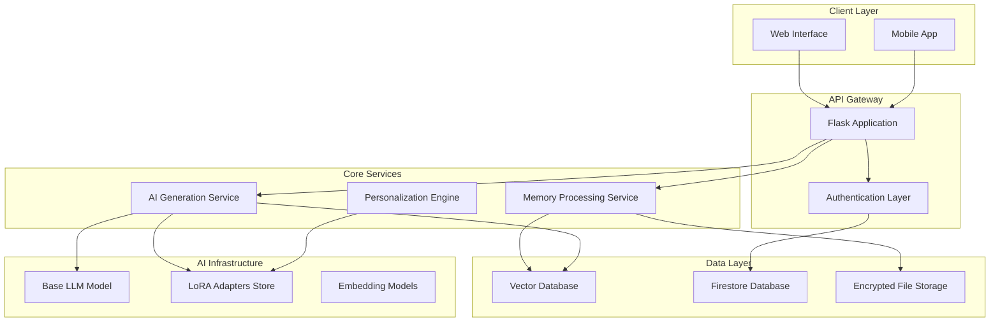
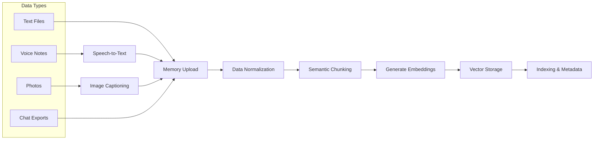

# Design Document

## Overview

The Memory-Driven AI Companion system extends the existing My Prabh platform to support personalized AI training based on user-uploaded memories. The architecture follows a cost-effective approach using a single base LLM with parameter-efficient personalization techniques, memory retrieval systems, and privacy-first design principles.

The system transforms personal data (texts, voice notes, photos, conversations) into a personalized AI companion that maintains emotional continuity and deep contextual understanding while ensuring complete user data ownership and privacy.

## Architecture

### High-Level Architecture



### Memory Processing Pipeline



## Components and Interfaces

### 1. Memory Upload Service

**Purpose**: Handle ingestion and processing of various memory data types

**Key Components**:
- File upload handler with validation and size limits
- Speech-to-text transcription service
- Image captioning and metadata extraction
- Data normalization and format standardization

**Interface**:
```python
class MemoryUploadService:
    def upload_memory(self, user_id: str, file_data: bytes, file_type: str) -> str
    def process_voice_note(self, audio_data: bytes) -> str
    def process_image(self, image_data: bytes) -> dict
    def validate_upload(self, file_data: bytes, file_type: str) -> bool
```

### 2. Memory Processing Engine

**Purpose**: Convert raw memories into searchable, contextual chunks

**Key Components**:
- Semantic text chunking (500-1500 tokens per chunk)
- Embedding generation using lightweight models
- Metadata extraction (timestamps, sentiment, relationships)
- Memory hierarchy management (short/mid/long-term)

**Interface**:
```python
class MemoryProcessor:
    def chunk_memory(self, text: str) -> List[MemoryChunk]
    def generate_embeddings(self, chunks: List[str]) -> List[np.ndarray]
    def extract_metadata(self, chunk: str) -> dict
    def categorize_memory(self, chunk: str) -> str
```

### 3. Personalization Engine

**Purpose**: Create and manage user-specific AI adaptations

**Key Components**:
- LoRA adapter training pipeline
- Persona prompt generation
- Personality trait extraction
- Conversation style analysis

**Interface**:
```python
class PersonalizationEngine:
    def create_persona_prompt(self, user_id: str) -> str
    def train_lora_adapter(self, user_id: str, memory_data: List[str]) -> str
    def update_personality_profile(self, user_id: str, interactions: List[dict]) -> dict
    def get_personalization_level(self, user_id: str) -> str
```

### 4. Enhanced AI Generation Service

**Purpose**: Generate contextually aware, personalized responses

**Extends existing OpenRouterAI service with**:
- Memory retrieval integration
- LoRA adapter loading
- Personality consistency enforcement
- Emotional context awareness

**Interface**:
```python
class EnhancedAIService(OpenRouterAI):
    def generate_memory_aware_response(self, user_message: str, context: dict) -> str
    def retrieve_relevant_memories(self, query: str, user_id: str, limit: int) -> List[dict]
    def load_user_adapter(self, user_id: str) -> bool
    def maintain_personality_consistency(self, response: str, personality: dict) -> str
```

### 5. Vector Memory Store

**Purpose**: Efficient storage and retrieval of memory embeddings

**Key Components**:
- Vector database (Pinecone/Qdrant/Milvus)
- Hybrid search (dense + sparse/BM25)
- User namespace isolation
- Memory retention policies

**Interface**:
```python
class VectorMemoryStore:
    def store_memory(self, user_id: str, chunk: str, embedding: np.ndarray, metadata: dict) -> str
    def search_memories(self, user_id: str, query_embedding: np.ndarray, limit: int) -> List[dict]
    def delete_user_memories(self, user_id: str) -> bool
    def update_memory_metadata(self, memory_id: str, metadata: dict) -> bool
```

## Data Models

### Memory Chunk Model
```python
@dataclass
class MemoryChunk:
    id: str
    user_id: str
    companion_id: str
    content: str
    embedding: List[float]
    metadata: dict
    memory_type: str  # emotional, factual, conversational
    source_type: str  # text, voice, photo, chat
    timestamp: datetime
    retention_policy: str  # short_term, mid_term, long_term
    privacy_level: str
```

### Personalization Profile Model
```python
@dataclass
class PersonalizationProfile:
    user_id: str
    companion_id: str
    personality_traits: dict
    communication_style: dict
    emotional_patterns: dict
    memory_preferences: dict
    adapter_path: Optional[str]
    persona_prompt: str
    last_updated: datetime
    personalization_level: str  # basic, enhanced, premium
```

### Memory Upload Session Model
```python
@dataclass
class MemoryUploadSession:
    session_id: str
    user_id: str
    companion_id: str
    uploaded_files: List[dict]
    processing_status: str
    total_chunks_created: int
    processing_errors: List[str]
    created_at: datetime
    completed_at: Optional[datetime]
```

## Error Handling

### Memory Processing Errors
- **File Format Errors**: Graceful handling of unsupported formats with clear user feedback
- **Transcription Failures**: Fallback to manual text input with partial transcription results
- **Embedding Generation Failures**: Retry mechanism with exponential backoff
- **Storage Failures**: Temporary local storage with background retry

### AI Generation Errors
- **Base Model Unavailability**: Fallback to cached responses and personality-based templates
- **Adapter Loading Failures**: Graceful degradation to persona-prompt mode
- **Memory Retrieval Failures**: Continue conversation with base personality
- **Rate Limiting**: Queue management with user notification

### Privacy and Security Errors
- **Encryption Failures**: Immediate processing halt with secure cleanup
- **Access Control Violations**: Audit logging and immediate session termination
- **Data Breach Detection**: Automated incident response and user notification

## Testing Strategy

### Unit Testing
- **Memory Processing**: Test chunking algorithms, embedding generation, metadata extraction
- **Personalization Engine**: Test adapter training, persona generation, personality analysis
- **AI Generation**: Test response quality, personality consistency, memory integration
- **Vector Store**: Test search accuracy, performance, data isolation

### Integration Testing
- **End-to-End Memory Flow**: Upload → Process → Store → Retrieve → Generate
- **Multi-Companion Management**: Test data isolation between different AI companions
- **Privacy Controls**: Test data export, deletion, and access controls
- **Performance Testing**: Test system behavior under load with large memory sets

### User Acceptance Testing
- **Memory Upload Experience**: Test various file types and sizes
- **Conversation Quality**: Test personality consistency and memory recall
- **Privacy Controls**: Test user data management capabilities
- **Multi-Device Sync**: Test conversation continuity across devices

### Security Testing
- **Data Encryption**: Verify end-to-end encryption of all memory data
- **Access Controls**: Test user isolation and permission systems
- **Input Validation**: Test against malicious file uploads and injection attacks
- **Privacy Compliance**: Verify GDPR/CCPA compliance mechanisms

## Implementation Phases

### Phase 1: Core Memory System (MVP)
- Basic memory upload (text files only)
- Simple chunking and embedding generation
- RAG-based retrieval with persona prompts
- Basic conversation interface

### Phase 2: Enhanced Personalization
- Voice note transcription
- Image processing and captioning
- LoRA adapter training pipeline
- Advanced personality analysis

### Phase 3: Advanced Features
- Multi-modal memory processing
- Emotional intelligence enhancement
- Voice synthesis matching
- Advanced privacy controls

### Phase 4: Scale and Optimization
- Performance optimization
- Advanced caching strategies
- Multi-region deployment
- Enterprise features

## Security and Privacy Considerations

### Data Encryption
- **At Rest**: AES-256 encryption for all stored memory data
- **In Transit**: TLS 1.3 for all data transmission
- **Processing**: Encrypted memory during processing operations

### Access Controls
- **User Isolation**: Strict namespace separation in vector database
- **Companion Isolation**: Separate memory spaces for different AI companions
- **Admin Access**: Minimal admin access with full audit logging

### Privacy Rights
- **Data Portability**: Complete memory export in standard formats
- **Right to Deletion**: Secure deletion of all user data and models
- **Consent Management**: Granular consent for different data types and processing

### Compliance
- **GDPR Compliance**: Full compliance with European data protection regulations
- **CCPA Compliance**: California privacy rights implementation
- **Data Residency**: Configurable data storage locations